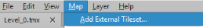
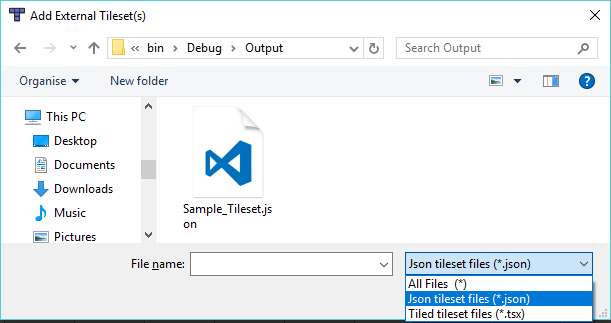

# Going from Pyxel to Tiled

1. Open your *.pyxel file in Pyxel
2. Create a layer called "Sheet" and place the tiles you want to use on it. The canvas now contains the tileset layout Tiled will use.
3. Save your changes
4. Drag & drop your *.pyxel file onto Tyxel.exe to create a Tyxel project file and 
5. Create a new map in Tiled and add the external tileset that Tyxel created next to your *.pyxel file. The file should have the suffix _Tileset by default._  
  
*(Make sure you look for \*.json files)*  

